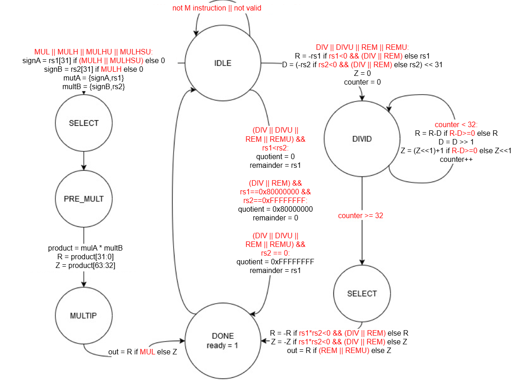
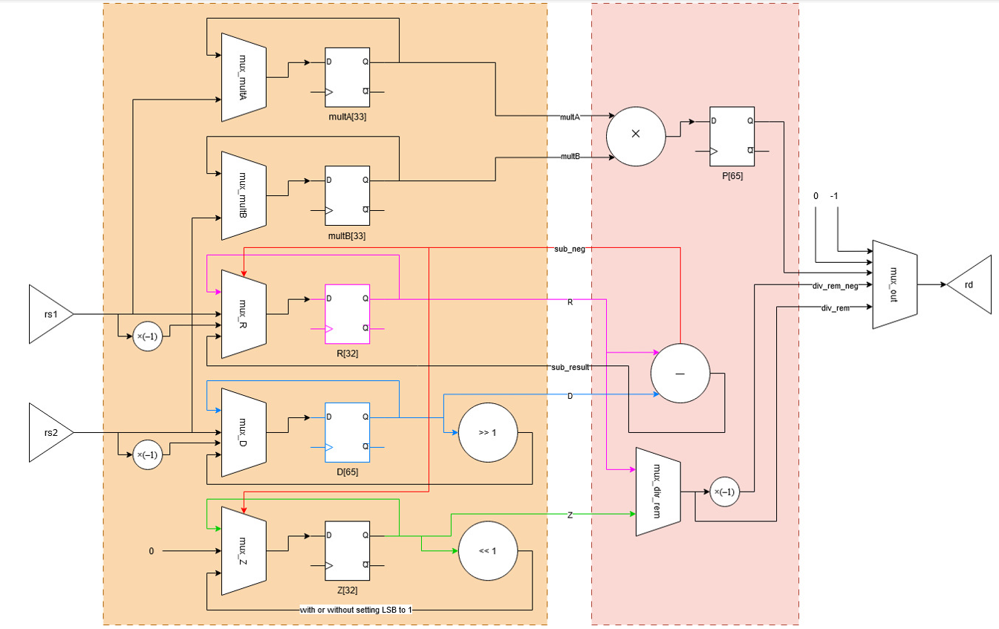
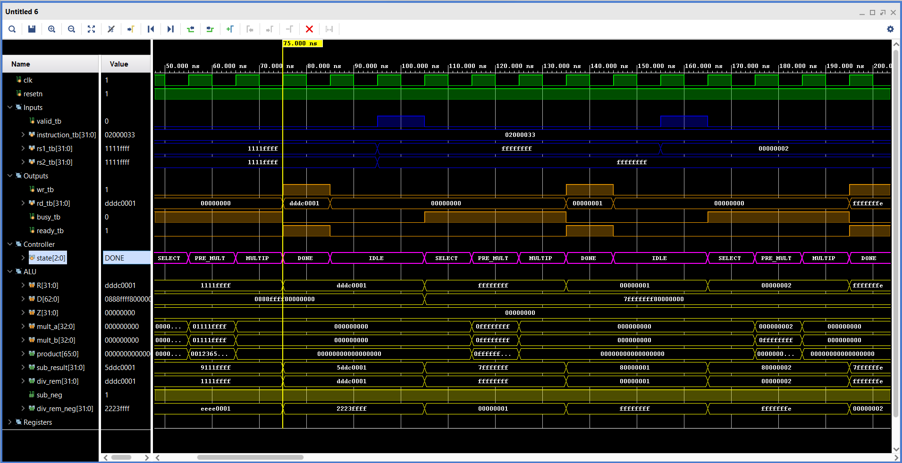
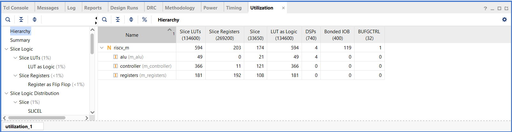

# RISC-V M Extension (Multiply/Divide Unit)

This repository contains the RTL design and verification environment for a RISC-V RV32IM **M-Extension** — implementing hardware support for integer multiplication and division instructions in **SystemVerilog**.  
The design replaces software emulation routines with dedicated hardware datapath and control logic, enabling faster arithmetic execution in embedded RISC-V cores.

---

## 📁 Repository Structure
```
├── src/  
│ ├── riscv_m.sv  
│ ├── m_alu.sv 
│ ├── m_controller.sv 
│ ├── m_registers.sv 
│ ├── m_definitions.svh 
│
├── tb/
│ ├── m_unit_tb.sv 
│ ├── test_m_registers.sv 
│
├── imgs/ # Architecture diagrams and simulation/synthesis results
│
├── LICENSE
└── README.md
```

---

## ⚙️ Design Overview

### 🔸 Architecture

The M-Extension module is composed of two main subsystems:

| Component       | Description |
|-----------------|------------|
| FSM Controller | Controls sequencing for multiply/divide operations, synchronising data movement between registers and arithmetic units. |
| Datapath | Implements arithmetic operations using 32-bit signed/unsigned multipliers and dividers, plus remainder handling logic. |

### 🔸 FSM Controller

The finite state machine (FSM) governs sequencing of multiplication and division operations.  

**FSM State Diagram:**

  

#### Description
- Transitions through states:
  - `IDLE → SELECT → PRE_MULT → MULTIP → DONE` for multiplication
  - `IDLE → DIVID → SELECT → DONE` for division/remainder
- Handles operand sign management and special corner cases (`rs2 == 0`, overflow, etc.)
- Generates control signals for register and multiplexer selection in the datapath.

---

### 🔸 Datapath Structure

The datapath performs all arithmetic operations and bit manipulations under FSM control.

**Datapath Block Diagram:**

  

#### Description
- **Multiplexers (mux_R, mux_D, mux_Z, mux_multA, mux_multB):** select inputs for signed/unsigned operations.
- **Registers (R, D, Z):** hold intermediate quotient, divisor, and remainder values.
- **Multiplier/Divider logic:** performs iterative or parallel arithmetic.
- **Output selection:** chooses between product, quotient, or remainder based on instruction type.

---

### 🔸 Handshake Protocol
- `valid` → initiates M-extension instruction  
- `busy` → asserted during operation  
- `ready` → indicates result availability  

---

### 🔸 Top-Level Signals

| Signal       | Dir | Width | Description |
|-------------|-----|-------|-------------|
| clk         | in  | 1     | System clock |
| resetn      | in  | 1     | Active-low reset |
| valid       | in  | 1     | Instruction valid flag |
| instruction | in  | 32    | Encoded RISC-V M instruction |
| rs1, rs2    | in  | 32    | Source operands |
| rd          | out | 32    | Result value |
| wr          | out | 1     | Write-enable to register file |
| busy        | out | 1     | Operation in progress |
| ready       | out | 1     | Operation complete |

---

### 🔸 Supported **RISC-V M-Extension Instructions:**

| Instruction | Description |
|-------------|------------|
| MUL         | Multiply lower 32 bits of result |
| MULH        | Multiply high signed × signed |
| MULHSU      | Multiply high signed × unsigned |
| MULHU       | Multiply high unsigned × unsigned |
| DIV         | Signed division |
| DIVU        | Unsigned division |
| REM         | Signed remainder |
| REMU        | Unsigned remainder |

---

## 🧩 Verification

### 🧪 Top-Level Functional Testbench — `m_unit_tb.sv`
Verifies all M-Extension instructions with directed and randomised tests.

| Test Category | Coverage |
|---------------|---------|
| MUL / MULH / MULHSU / MULHU | Signed & unsigned multiplication paths |
| DIV / DIVU | Signed/unsigned division, zero-divisor and overflow handling |
| REM / REMU | Remainder correctness under various operand signs |
| Randomised Division Tests | 1000 iterations for statistical correctness |

---

### 🔍 Datapath Register Testbench — `test_m_registers.sv`
Unit-level verification for internal multiplexers and register updates.

| Feature Tested       | Description |
|---------------------|------------|
| mux_R               | Controls remainder register source/negation |
| mux_D               | Controls divisor register and shifts |
| mux_Z               | Controls quotient register updates |
| mux_multA, mux_multB | Validate signed/unsigned operand control |
| Sequential updates  | Clocked behavior and reset retention checks |

---

## 🖥️ Simulation Instructions

### 🔹 Using Vivado
1. Add all `src/` and `tb/` files to a new simulation project.  
2. Set `m_unit_tb` as the top-level simulation module.  
3. Run simulation for at least 2000 ns.  
4. Observe printed results in the console or waveform viewer.  

---

### 📈 **Simulation Waveform**
The following simulation waveform illustrates the execution of a multiplication instruction within the **RISC-V M-extension unit**.



#### Description
- FSM transitions: `IDLE → SELECT → PRE_MULT → MULTIP → DONE`
- ALU updates intermediate registers (`multA`, `multB`, `product`, etc.)
- Output `rd_tb` holds the final multiplication result.
- `busy_tb` and `ready_tb` indicate operation progress and completion.

---

## 📊 Implementation Results

**Target Platform:**  
Xilinx Vivado Design Suite – Artix-7 AC701 Evaluation Board (`xc7a200tfbg676-2`)

---

### ⏱️ **Timing Summary**

- **System Clock:** 100 MHz  
- **Clock Period:** 10 ns  

| Parameter | Value |
|------------|--------|
| **Worst Negative Slack (WNS)** | 2.437 ns |
| **Worst Hold Slack (WHS)** | 0.131 ns |


✅ **All timing constraints met.**  
The positive WNS indicates that the design can potentially operate at a frequency higher than 100 MHz.

---

### 🧱 **Resource Utilisation**

| Resource | Used | Available | Utilisation |
|-----------|-------|------------|--------------|
| **Slice LUTs** | 594 | 134,600 | 0.44% |
| **Slice Registers** | 203 | 269,200 | 0.08% |
| **DSPs** | 4 | 740 | 0.54% |



✅ **Compact and efficient implementation** — uses **less than 1%** of FPGA logic resources.  
Hardware multiplication and division in the M-extension are implemented using 4 DSP blocks only, keeping resource usage minimal.

---

## 🚧 Future Work
- Add support for 64-bit (RV64IM) instructions  
- Integrate pipeline stall/forwarding signals  
- Expand testbench automation with coverage metrics  

---

## 👩‍💻 Authors
**Ayesha Quddus, Talha Israr, Gustavo Magalhaes**  
MS Embedded Computing Systems

---

## 📜 License
Released under the **MIT License** — free to use, modify, and distribute with attribution.
